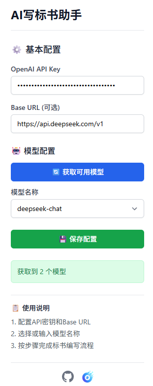
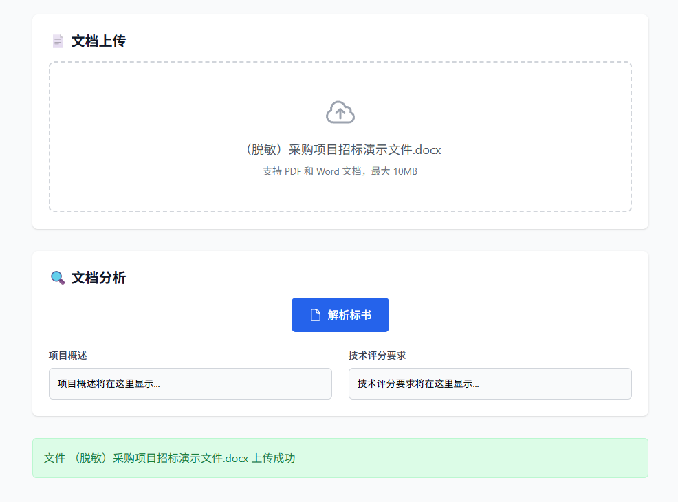
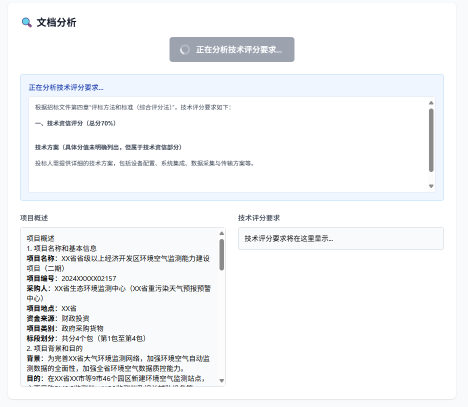
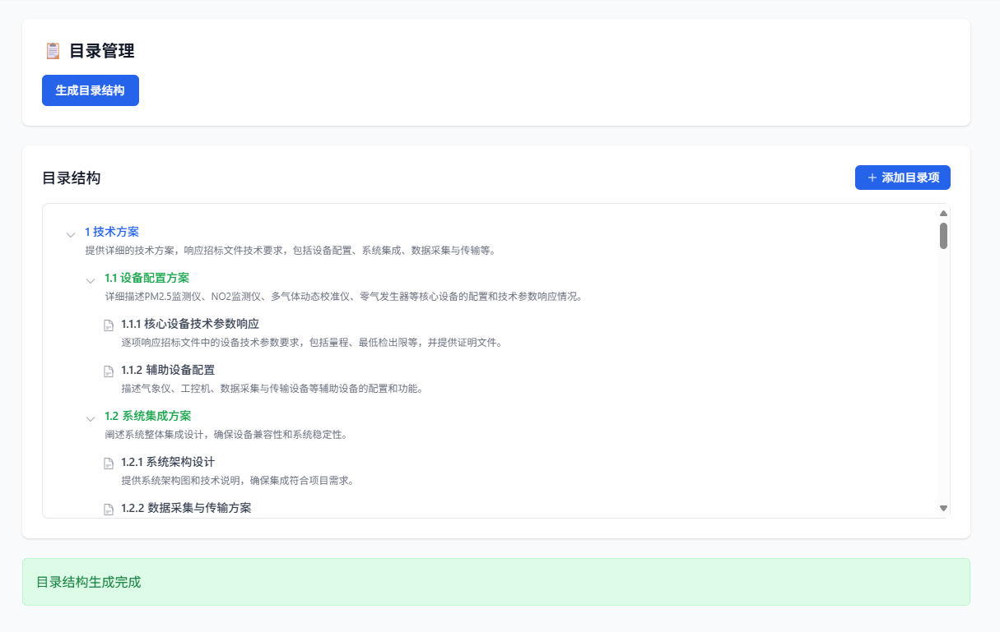
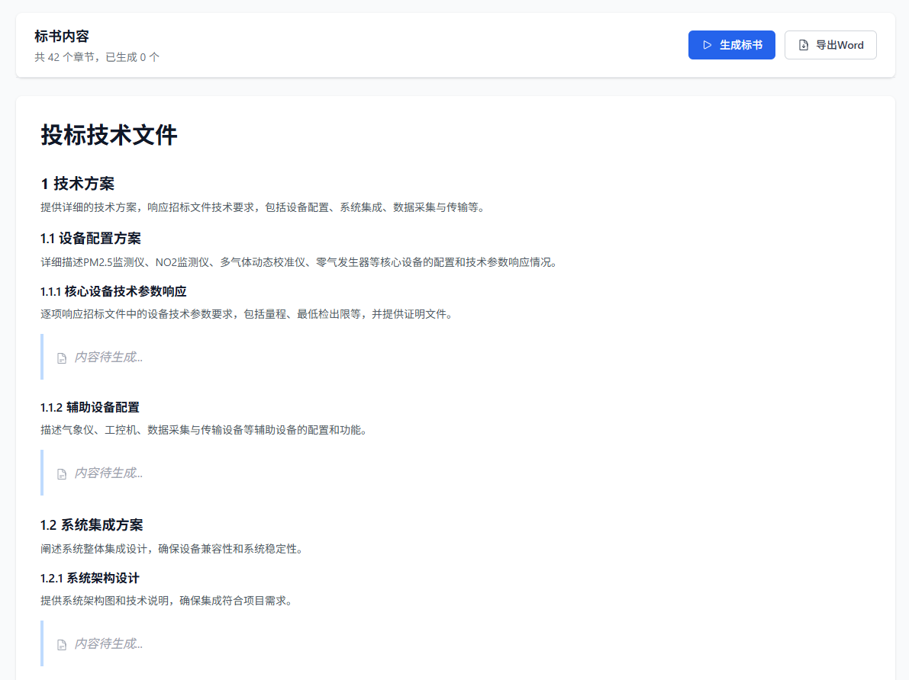
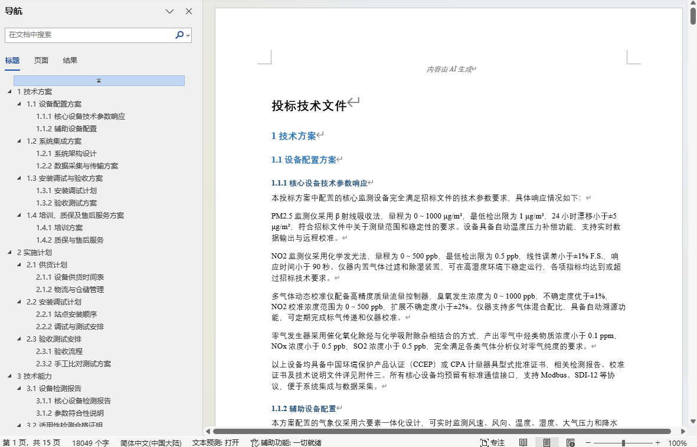

# BidCraft AI - 智能标书写作助手

<p align="center">
  
  
  
  
</p>

<p align="left">
  <strong>🚀 基于 AI 的智能标书写作助手，让标书制作变得简单高效</strong>
</p>

## ✨ 核心功能

- **📄 智能文档解析**：自动分析招标文件（PDF/Word），提取项目概述和技术评分要求
- **📋 AI生成目录**：基于招标文件智能生成专业的三级标书目录结构
- **✍️ 内容自动生成**：为每个章节自动生成高质量、针对性的标书内容
- **📦 大文件分片上传**：支持超过10MB的大文件自动分片上传（5MB/片），支持断点续传
- **💾 云端存储支持**：集成MinIO对象存储，支持大文件管理
- **🔍 向量语义检索**：集成Qdrant向量数据库，支持标书内容语义搜索
- **⚡ Redis缓存加速**：智能缓存机制，提升响应速度
- **📤 一键导出**：导出Word文档，自由编辑

## 🌟 产品优势

- **⏱️ 效率提升**：将传统需要数天的标书制作缩短至几小时
- **🎨 专业质量**：AI生成的内容结构清晰、逻辑严密、符合行业标准
- **🔧 易于使用**：简洁直观的界面设计，无需专业培训即可上手
- **☁️ 云端支持**：支持私有化部署，兼容MinIO对象存储
- **🔄 持续优化**：基于用户反馈不断改进AI算法和用户体验

## 📦 系统要求

- **操作系统**：Windows 10/11 (64位) 或 Linux/Mac
- **Python**：3.11+
- **内存**：至少 4GB RAM
- **磁盘空间**：100MB 可用空间

## 🚀 快速开始

### 方式一：运行exe（Windows）

1. 从 [GitHub Releases](https://github.com/aihuanghe/bidcraft-ai/releases) 下载最新版本的exe文件
2. 双击 `BidCraft-AI.exe` 启动应用
3. 访问 http://localhost:8000

### 方式二：开发模式

```bash
# 克隆项目
git clone https://github.com/aihuanghe/bidcraft-ai.git
cd bidcraft-ai

# 安装后端依赖
cd backend
pip install -r requirements.txt

# 启动后端服务
python app_launcher.py
# 或
cd backend
python -m uvicorn app.main:app --host 127.0.0.1 --port 8000 --reload
```

### 方式三：Docker部署

```bash
# 启动所有服务（Redis + MinIO + Qdrant + 后端）
docker-compose up -d

# 或只启动基础设施
docker-compose up -d redis minio qdrant
```

## 📝 使用流程

1. **⚙️ 配置AI**：支持所有OpenAI兼容的大模型，推荐使用DeepSeek
   

2. **📄 文档上传**：上传招标文件（支持Word和PDF格式），大文件自动分片
   

3. **🔍 文档分析**：AI自动解析招标文件，提取项目概述和技术要求
   

4. **📋 生成目录**：基于分析结果智能生成标书目录结构
   

5. **✍️ 生成正文**：为各章节生成内容，多线程并发，极速体验
   

6. **📤 导出标书**：一键导出完整的标书Word文档
   

## 🛠️ 技术架构

### 整体架构

采用现代化的**前后端分离架构**，确保高性能和良好的用户体验：

| 层级 | 技术栈 |
|------|--------|
| 前端 | React 18 + TypeScript + Tailwind CSS |
| 后端 | FastAPI + Python 3.11 |
| 数据库 | SQLite + SQLAlchemy |
| 缓存/队列 | Redis |
| 对象存储 | MinIO |
| 向量检索 | Qdrant |
| AI集成 | OpenAI SDK |

### 项目结构

```
bidcraft-ai/
├── backend/                    # 后端服务
│   ├── app/
│   │   ├── main.py           # FastAPI应用入口
│   │   ├── config.py         # 应用配置
│   │   ├── routers/          # API路由
│   │   │   ├── config.py     # 配置管理
│   │   │   ├── document.py   # 文档处理
│   │   │   ├── outline.py    # 目录生成
│   │   │   ├── content.py    # 内容生成
│   │   │   ├── projects.py   # 项目管理
│   │   │   ├── materials.py   # 企业资料
│   │   │   ├── storage.py    # 文件存储
│   │   │   └── upload.py     # 分片上传
│   │   ├── services/         # 业务服务
│   │   │   ├── openai_service.py
│   │   │   ├── file_service.py
│   │   │   ├── redis_service.py
│   │   │   ├── minio_service.py
│   │   │   ├── qdrant_service.py
│   │   │   └── chunked_upload_service.py
│   │   ├── models/           # 数据模型
│   │   └── utils/            # 工具函数
│   ├── alembic/              # 数据库迁移
│   └── requirements.txt      # Python依赖
├── frontend/                 # 前端应用
│   ├── src/
│   │   ├── components/       # 可复用组件
│   │   ├── pages/           # 页面组件
│   │   ├── services/        # API服务
│   │   └── hooks/          # React Hooks
│   └── package.json
├── docker-compose.yml        # Docker编排
├── Dockerfile               # 后端容器镜像
├── build.py                # 打包脚本
└── README.md               # 项目文档
```

## 🔌 API接口

启动应用后访问 http://localhost:8000/docs 查看完整的Swagger API文档。

### 主要接口

| 接口 | 说明 |
|------|------|
| `POST /api/config/save` | 保存AI配置 |
| `POST /api/document/upload` | 上传文档（小文件） |
| `POST /api/upload/chunked/init` | 初始化分片上传 |
| `POST /api/upload/chunked/part/file` | 上传分片 |
| `POST /api/upload/chunked/complete` | 完成分片上传 |
| `GET /api/upload/chunked/status/{id}` | 查询上传状态 |
| `POST /api/document/analyze-stream` | 流式分析文档 |
| `POST /api/outline/generate-stream` | 流式生成目录 |
| `POST /api/content/generate-chapter-stream` | 流式生成内容 |
| `POST /api/document/export-word` | 导出Word文档 |
| `GET /api/projects/` | 获取项目列表 |
| `GET /api/materials/` | 获取企业资料列表 |

## 🐳 Docker部署

### 环境变量

创建 `.env` 文件：

```env
# 数据库
DATABASE__SQLITE_PATH=data/bidcraft.db

# Redis
REDIS__HOST=localhost
REDIS__PORT=6379

# MinIO
MINIO__ENDPOINT=localhost:9000
MINIO__ACCESS_KEY=minioadmin
MINIO__SECRET_KEY=minioadmin

# Qdrant
QDRANT__HOST=localhost
QDRANT__PORT=6333
```

### 启动服务

```bash
# 启动所有服务
docker-compose up -d

# 查看日志
docker-compose logs -f

# 停止服务
docker-compose down
```

## 🔧 生产环境打包

```bash
# 一键构建exe
python build.py
```

构建完成后，exe文件位于 `dist/BidCraft-AI.exe`

## 🤝 贡献指南

欢迎各种形式的贡献！

1. **🐛 问题反馈**：在 [Issues](https://github.com/aihuanghe/bidcraft-ai/issues) 中报告bug
2. **💡 功能建议**：提出新功能需求和改进建议
3. **🔧 代码贡献**：Fork项目，提交Pull Request
4. **📖 文档完善**：帮助改进文档和使用说明

## 📄 许可证

本项目基于 [MIT License](LICENSE) 开源协议发布。

## 🙋‍♂️ 联系我们

- **GitHub**：https://github.com/aihuanghe/bidcraft-ai
- **问题反馈**：https://github.com/aihuanghe/bidcraft-ai/issues

---

<p align="center">
  ⭐ 如果这个项目对您有帮助，请给我们一个Star支持！
</p>

<p align="center">
  Made with ❤️ by BidCraft Team
</p>
